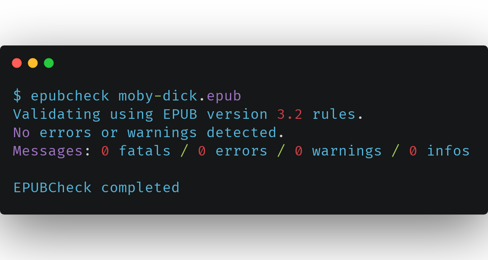
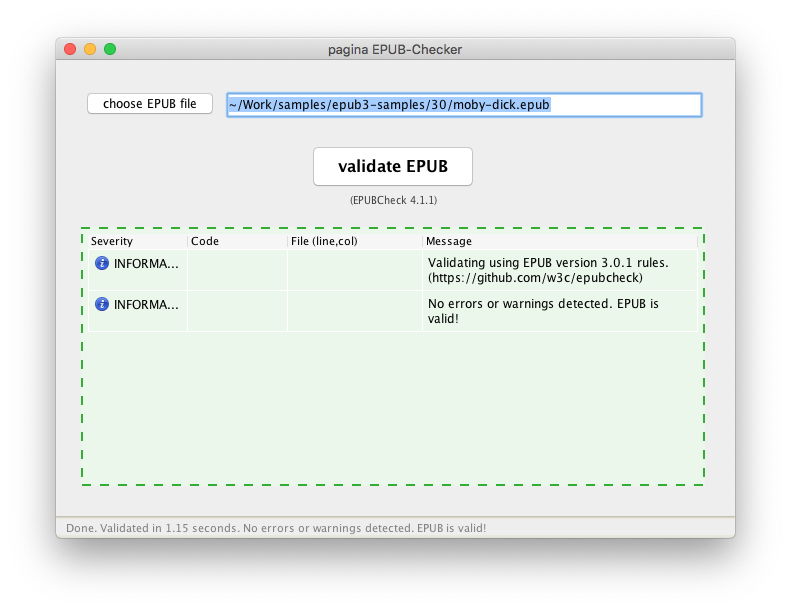
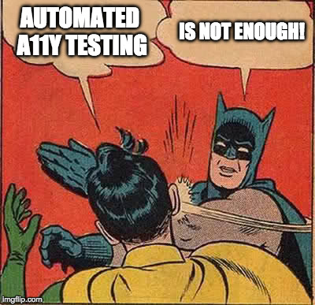

<!-- _footer: Journée d’étude AFNOR-BnF \n 25 Juin 2021 -->

# Quels outils de contrôle de l’EPUB 3 ?

Romain Deltour
DAISY Consortium
[@rdeltour](https://twitter.com/rdeltour)

---

<!-- paginate: true -->

## Comment faire de l’EPUB accessible ?

<svg xmlns='http://www.w3.org/2000/svg' version='1.1' preserveAspectRatio='xMidYMid' viewBox='0 0 100 100'>
  <path d='M80 20 L20 80' stroke='red' stroke-width='3' stroke-linecap='round'/>
  <path d='M20 20 L80 80' stroke='red' stroke-width='3' stroke-linecap='round'/>
</svg>

---

En fait c'est simple, il suffit de lire:

* 😃 EPUB 3
* 😀 EPUB Accessibility 1.0 
* 🙂 WCAG 
* 😐 WCAG Techniques 
* 🙁 ARIA 
* 😫 DPUB-ARIA 
* 😭 HTML in ARIA 
* 🤯 DIAGRAM (image descriptions) 

---

---

## Mais rassurez-vous !

- Une base solide, simple à mettre en oeuvre 💪
- Des outils sont là pour aider ! 👍

--- 
<!-- _class: sidebyside invert -->

## EPUBCheck

## Ace, by DAISY

---

## EPUBCheck

Le vérificateur officiel de conformité au standard EPUB

<!-- _footer: "EPUBCheck est un projet du W3C - logiciel libre sous license MIT" -->
---

<!-- _class: sidebyside invert -->

Ligne de commande

Application (tierce)

---

* ❌ Erreur ▸ EPUB non-conforme
* ⚠️ Warning ▸ EPUB conforme, mais…
* ℹ️ Info ▸ EPUB conforme

---

https://www.w3.org/publishing/epubcheck/

---

## Ace, by DAISY

Outil d’aide à l’évaluation d’accessibilité

<!-- _footer: "Ace est un projet du DAISY Consortium – logiciel libre sous license MIT" -->

---

* basé sur Axe (Deque Systems)
* tests automatisés (HTML et EPUB)
* extraction d'information
* liens vers la base de connaissance DAISY

---

<video src="./assets/ace.m4v" controls />

---

https://daisy.github.io/ace/

---
 
<h2> ⚠️   Les tests automatiques ne suffisent pas !!   ⚠️ </h2>

---

## Comment les mettre en œuvre ?

* ⏳ le plus tôt possible
* ⚙️ en automatisation…
* 🔎… et pour assister un audit manuel

---

## Des outils pour la communauté

🙋‍♀️ 🤝 👩‍💻

---

## Merci !

😊  🙏